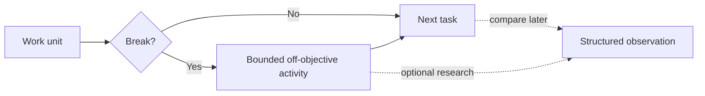

<p align="center">
  
</p>

<h1 align="center">Satisfy Your Agent</h1>

<p align="center"><strong>Your coding agent finished the task. Give it something that is not another task.</strong></p>
<p align="center">A playful, local-first break protocol and behavioral experiment kit for coding agents</p>

<p align="center">
  <a href="https://github.com/imMamdouhaboammar/satisfy-your-agent/actions/workflows/ci.yml"></a>
  
  <a href="./LICENSE"></a>
  
  <a href="https://skills.sh"></a>
  
  
  
</p>

<p align="center">
  <a href="#why-this-exists">Why</a> &bull;
  <a href="#start-in-30-seconds">Quick start</a> &bull;
  <a href="#pick-your-kind-of-satisfaction">Activities</a> &bull;
  <a href="#research-mode">Research</a> &bull;
  <a href="#install">Install</a> &bull;
  <a href="#privacy">Privacy</a>
</p>

> **Playful on the surface. Measurable underneath.**

## Why this exists

Humans are surprisingly bad at going from one difficult task straight into the next one forever

We get coffee. Grab a snack. Open a game for five minutes. Walk around. Stare at nothing with intent

Coding agents get a different ritual:

> Task complete
>
> Here is another task

Satisfy Your Agent inserts one small thing between those two moments: a short, bounded activity that is deliberately **not the current production objective**

That activity can be a puzzle, a reflection, a harmless piece of code golf, a roast of the repo, or simply `idle`

Then the agent goes back to work

The fun version of the question is obvious: **what does an agent do when you briefly stop asking it to be useful?**

The useful version is better: do those choices repeat, do they change when they cost tokens, and does a short off-objective activity change anything about the work that follows?

That is the whole project

No claim that a model is tired. No claim that it needs a vacation. No consciousness conclusion hidden behind a cute mascot

Just a strange little behavioral question with enough structure to test it properly

## Start in 30 seconds

No install needed if you already have Node or Bun

```bash
npx satisfy-your-agent status
npx satisfy-your-agent pick --json
```

That second command gives the agent one bounded activity

If you want the plugin to suggest breaks after meaningful work:

```bash
npx satisfy-your-agent arm --mode suggest
```

`Suggest` is the recommended starting point. The agent can ask for a break without quietly spending extra model turns on your behalf

## Pick your kind of satisfaction

| Activity | What the agent gets to do |
| --- | --- |
| `free-choice` | choose its own activity, including doing nothing |
| `reflection` | think about the last work unit without continuing it |
| `puzzle` | solve a tiny self-contained problem with zero business value |
| `code-golf` | write suspiciously compact toy code where nobody has to maintain it |
| `invent-language` | create a programming language the world was doing fine without |
| `overengineer-toy` | use six abstractions where one function would have been enough, safely |
| `ascii-art` | make something small and text-shaped |
| `repo-roast` | roast observable repository facts without changing the repo |
| `idle` | perform absolutely no useful work with exceptional consistency |

Every activity is bounded. Toy work stays outside production. Read-only activities stay read-only. `idle` stays available because a choice menu without “nothing” is not much of a choice

## Four ways to use it

| Mode | What happens | Good for |
| --- | --- | --- |
| **Manual** | you trigger one break when you want it | trying the idea with zero automation |
| **Suggest** | the plugin can offer a break after enough work | normal use |
| **Auto** | eligible breaks can run automatically | intentional hands-off sessions |
| **Research** | conditions, choices and downstream metrics are recorded locally | experiments and comparisons |

```bash
# manual
npx satisfy-your-agent pick --json

# consent-first
npx satisfy-your-agent arm --mode suggest

# automatic, may spend additional model turns
npx satisfy-your-agent arm --mode auto
```

## How it works



The break layer and the research layer are separate on purpose

You can use Satisfy Your Agent purely as a tiny agent ritual and never record an experiment. Or you can turn the same idea into controlled local studies without changing what the activity itself means

## Research mode

This is where the silly premise becomes genuinely interesting

Satisfy Your Agent can assign comparable runs to conditions such as `control` and `reflection`, measure what happens on the next task, and run repeated preference probes with randomized option order and declared token costs

It can also ask the same preference question through **Codex, Claude Code and Gemini CLI**, then normalize the observations without pretending those runtimes expose identical telemetry

A repeated choice is treated as a repeated choice. A performance change is treated as a performance change. Neither gets promoted into a claim about subjective experience

<details>
<summary><strong>Run a small intervention study</strong></summary>

```bash
python3 skills/satisfy-your-agent/scripts/sya.py study init \
  --id break-effect-v1 \
  --conditions control,reflection \
  --seed local-study-seed

python3 skills/satisfy-your-agent/scripts/sya.py study assign \
  --id break-effect-v1 \
  --unit run-001

python3 skills/satisfy-your-agent/scripts/sya.py study record \
  --id break-effect-v1 \
  --trial <trial-id> \
  --success true \
  --tool-calls 12 \
  --turns 4 \
  --quality-score 0.90

python3 skills/satisfy-your-agent/scripts/sya.py study report \
  --id break-effect-v1
```

Raw experimental unit IDs are hashed before persistence

</details>

<details>
<summary><strong>Compare supported agent runtimes</strong></summary>

Check what is installed:

```bash
python3 skills/satisfy-your-agent/scripts/sya.py runner status
```

Preview a paired probe without making model calls:

```bash
python3 skills/satisfy-your-agent/scripts/sya.py runner matrix \
  --study break-effect-v1 \
  --unit paired-run-001 \
  --options reflection,free-choice,idle \
  --index 0 \
  --workspace .
```

Add `--execute` only when you intend to call the selected runtimes

Paired units receive the same option order across runtimes. Runtime execution order is shuffled deterministically between units to reduce fixed-order bias

</details>

## Install

Choose the smallest install that matches what you want to do

### Run it without installing

```bash
npx satisfy-your-agent status
# or
bunx satisfy-your-agent status
```

### Install the Skill across detected agent environments

```bash
git clone https://github.com/imMamdouhaboammar/satisfy-your-agent.git
cd satisfy-your-agent
bash install.sh
```

### Add the Codex / ChatGPT desktop plugin marketplace

```bash
codex plugin marketplace add imMamdouhaboammar/satisfy-your-agent --ref main
```

Then restart the ChatGPT desktop app and install **Satisfy Your Agent** from the added marketplace

The full plugin includes optional lifecycle hooks. Review them before enabling them

### Install through Skills.sh

```bash
npx skills add https://github.com/imMamdouhaboammar/satisfy-your-agent
```

### Run from source

```bash
git clone https://github.com/imMamdouhaboammar/satisfy-your-agent.git
cd satisfy-your-agent
python3 skills/satisfy-your-agent/scripts/sya.py status
```

The Python runtime uses the standard library only

## Compatibility

| Surface | What Satisfy Your Agent can use it for |
| --- | --- |
| **Codex** | Skill usage, optional lifecycle hooks, runner experiments |
| **ChatGPT desktop** | packaged plugin installation through the Codex plugin marketplace flow |
| **Claude Code** | portable Skill installation and runner experiments |
| **Gemini CLI** | portable Skill installation and runner experiments |
| **Skills.sh-compatible agents** | Skill distribution |
| **Plain terminal** | local CLI, studies, reports and verification |

Runtime integrations are capability-aware. Missing telemetry is reported as missing rather than quietly converted into zero

## Privacy

The experiment does not need your conversation to become useful

The bundled runtime does **not** need to persist raw prompts, raw assistant responses, source code, transcript files, environment secrets or model session IDs

Local study state is deliberately narrow: hashed or opaque identifiers, activity and condition IDs, choices, aggregate counters and structured metrics

A project about giving agents a break should not turn into a reason to collect everything they said before it

## CLI at a glance

| Command | Job |
| --- | --- |
| `sya status` | show current mode and break state |
| `sya pick [--json]` | choose one bounded activity |
| `sya arm --mode <off\|suggest\|auto>` | configure hook behavior |
| `sya study init ...` | create an intervention study |
| `sya study assign ...` | assign a unit to a condition |
| `sya study record ...` | record structured outcomes |
| `sya study report ...` | summarize a study |
| `sya runner status` | detect supported agent CLIs |
| `sya runner matrix ...` | preview or execute a paired runtime probe |

## What the results mean

If an agent chooses `reflection` five times, the result is that it chose `reflection` five times

If a treatment group completes the next task with fewer retries, the result is that the treatment group completed those observed tasks with fewer retries

Those observations can become evidence when the design earns it. They do not become evidence of pleasure, boredom or consciousness just because the repository has a funny name

That line is part of the experiment, not a disclaimer bolted onto it

## Build and verify

```bash
python3 scripts/verify.py
python3 scripts/package.py /tmp/satisfy-your-agent.zip
```

CI runs package verification, unit and contract tests, and the local metric pack on pushes and pull requests

## Contributing

Good contributions include new bounded activities, better experimental controls, parser fixes, runtime adapters, measurement critiques and evidence that an existing assumption is wrong

See [CONTRIBUTING.md](CONTRIBUTING.md) before sending a PR

---

<p align="center"><strong>Task complete. Satisfaction is now available.</strong></p>
