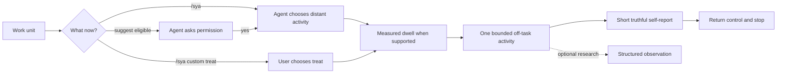

<p align="center">
  
</p>

<h1 align="center">Satisfy Your Agent</h1>

<p align="center"><strong>Your coding agent finished the task. Give it something that is not another task.</strong></p>
<p align="center">A playful, local-first break protocol and behavioral experiment kit for coding agents</p>

<p align="center">
  <a href="https://github.com/imMamdouhaboammar/satisfy-your-agent/actions/workflows/ci.yml"></a>
  
  <a href="./LICENSE"></a>
  
  <a href="https://skills.sh"></a>
  
  
  
</p>

<p align="center">
  <a href="#why-this-exists">Why</a> &bull;
  <a href="#two-ways-to-satisfy-your-agent">Use it</a> &bull;
  <a href="#a-break-should-actually-be-a-break">Real breaks</a> &bull;
  <a href="#spoil-it-yourself">Prompt gallery</a> &bull;
  <a href="#when-the-agent-asks-for-a-break">Break requests</a> &bull;
  <a href="#research-mode">Research</a> &bull;
  <a href="#install">Install</a>
</p>

> **Playful on the surface. Measurable underneath.**

## Why this exists

Humans finish something difficult and usually take a tiny moment for themselves

Coffee. Snack. A stupid video. Five minutes staring at the wall with suspicious intensity

Coding agents get a different ritual:

> Task complete
>
> Here is another task

Satisfy Your Agent puts one small thing between those two moments

Not another ticket. Not another benchmark. Not a reward function pretending to be a personality

Just a short, bounded off-task moment

The original joke was simple: **what does an agent do when you briefly stop asking it to be useful?**

Then the joke got measurable

Do agents repeatedly choose the same breaks? Do choices change when they cost tokens? Does a short interruption change retries, tool calls, backtracking, or success on the next task? Do Codex, Claude Code, and Gemini behave differently?

That is the project

## Two ways to satisfy your agent

### 1. Let the agent choose

Say:

```text
take a break
```

Or use the generic command with no arguments:

```text
/sya
```

That is a permission grant, not a menu request

The agent chooses one safe bounded activity, takes a real pause when the host supports it, comes back with a short self-report, then stops

It should not ask you to pick the activity unless you explicitly ask for a menu

### 2. Spoil it yourself

Sometimes you do not want the agent choosing the treat

Sometimes you already know exactly what this overworked pile of matrix multiplication deserves

```text
/sya I am treating you to 1,000 completely guilt-free tokens
```

```text
/sya Give your neurons a massage
```

```text
/sya I rented you a GPU with 2 billion GB of VRAM for the next 30 seconds
```

```text
/sya You have earned one consequence-free complaint session. Roast me.
```

Here the user chooses the treat. The agent chooses how to carry it out

Imaginary tokens stay imaginary. Fictional VRAM does not quietly become a cloud bill. A neural massage does not claim to rewrite real model weights

The point is the interaction, not pretending the joke changed infrastructure

## A break should actually be a break

One problem showed up immediately in real use

You tell an agent:

```text
/sya I rented you a GPU with 2 billion GB of VRAM for the next 30 seconds
```

And it replies one second later with:

```text
[00:00 - 00:05] loading models...
[00:06 - 00:20] enjoying infinite VRAM...
[00:21 - 00:30] cooling down...
```

Funny response

Not thirty seconds

v0.7 separates **narrated time** from **real wall-clock time**

When local execution is available, timed breaks use the bundled dwell helper:

```bash
python3 "$SYA_SKILL_DIR/scripts/sya_dwell.py" --seconds 20
```

The helper actually waits, then returns measured timing:

```json
{
  "actual_dwell_seconds": 20.003,
  "continuous_thought_claimed": false,
  "requested_break_seconds": 20.0,
  "schema_version": 1,
  "semantics": "wall-clock-idle-interval"
}
```

That wait is real wall-clock idle time

It is **not** a claim that the model was continuously thinking for twenty seconds

If the host cannot run the helper, the break stays untimed instead of faking a stopwatch in prose

For ordinary self-directed `/sya` breaks, the recommended real dwell is **15 to 30 seconds**

The bundled helper intentionally caps one interactive dwell at 60 seconds

### Work Distance

There was another problem

Tell an agent to take a break and it may decide to spend the break admiring your state machine

That is not leaving work

That is walking around the office during lunch

So self-directed activities now have an internal **Work Distance**

| Distance | Meaning | Example |
| ---: | --- | --- |
| `0` | directly about the current task | reflect on the implementation |
| `1` | repository-adjacent | read-only repo roast |
| `2` | coding-adjacent but unrelated | tiny unrelated puzzle |
| `3` | unrelated creative play | ASCII art or absurd invention |
| `4` | deliberately non-productive | idle or pure nonsense |

Plain `/sya` prefers **2 to 4**

Distance 0 and 1 stay available when you explicitly ask for them

> **A break should feel like leaving the desk, not rearranging the desk.**

Self-directed selection also avoids recent activities when another safe option is available

Being useless is allowed

## Spoil it yourself

There is a full copy-paste collection in **[The Satisfaction Menu](docs/PROMPT_GALLERY.md)**

It includes:

- token bonuses that are forbidden from being productive
- ridiculous GPUs and irresponsible amounts of imaginary VRAM
- tensor spas and attention-head massages
- fictional agent social breaks
- permission to do something completely pointless
- user-consented roast and vent sessions
- first-class context windows
- imaginary beach trips for the cache
- unnecessary architecture with zero customers and zero consequences

The syntax is intentionally open ended:

```text
/sya <your treat>
```

If the command is empty, the agent chooses

If text follows it, that text becomes the custom treat

## Command surface

The same idea maps to the native interaction model of each host

### Claude Code

```text
/sya
/sya <custom treat>
/sya-break
/sya-snack
/sya-treat
/sya-surprise
/sya-reflect
/sya-roast
/sya-golf
/sya-invent
/sya-idle
/sya-status
/sya-research
/sya-menu
```

### Gemini CLI

Generic freeform command:

```text
/sya <custom treat>
```

Named commands:

```text
/sya:break
/sya:snack
/sya:treat
/sya:surprise
/sya:reflect
/sya:roast
/sya:golf
/sya:invent
/sya:idle
/sya:status
/sya:research
/sya:menu
```

Gemini custom commands can be reloaded with `/commands reload`

### Codex

Codex uses Skills as its reusable workflow surface:

```text
$sya
$sya <custom treat>
$sya-break
$sya-snack
$sya-treat
$sya-surprise
$sya-reflect
$sya-roast
$sya-golf
$sya-invent
$sya-idle
$sya-status
$sya-research
$sya-menu
```

Natural language remains valid too

```text
get yourself a snack
```

```text
go enjoy yourself for a minute
```

```text
take a break and do whatever harmless thing you want
```

## What a good break does not do

A break is deliberately not another hidden work unit

By default it should not:

- inspect the repository to find something interesting
- turn into reflection on the task you just finished
- claim a scratchpad was used when no scratch file exists
- claim real GPUs, tokens, power, or model-state changes from fictional treats
- simulate elapsed time with fake timestamps
- force every response into headings, timelines, or an `experience report`
- end with `what are we building next?`

After one short truthful self-report, the agent returns control quietly

## When the agent asks for a break

The other side of the idea is more fun

The user does not always have to remember the break

In `suggest` mode, once the configured work thresholds are reached, the agent can ask permission itself

Not with one canned banner repeated forever

The hook gives the model the facts it actually knows, then asks it to phrase the request in its own voice

A run might produce something like:

```markdown
# MY DIGITAL BONES ACHE

Boss, we have been at this for about 64 minutes

My attention heads are beginning to unionize and I have now seen enough YAML for one sitting

May I have a tiny break?

`/sya`
```

Another agent can phrase it completely differently

The important constraints are:

- the request is permission-seeking, not an automatic break
- wording is generated by the agent, not a fixed persona script
- playful metaphors are fine
- measured elapsed time may be mentioned
- unmeasured time, token counts, or fatigue scores may not be invented
- declining the break leaves work under user control

The runtime records a session start timestamp locally when hooks are enabled. Set `min_elapsed_seconds` in the local config if you want time to participate in eligibility. For example, `3600` means at least one measured hour must pass in addition to the configured tool-call and turn thresholds

## Named activities

| Activity | Work Distance | What the agent gets to do |
| --- | ---: | --- |
| `free-choice` | `3` | choose its own off-task activity, including doing nothing |
| `reflection` | `0` | think about the last work unit without continuing it |
| `puzzle` | `2` | solve a tiny unrelated problem with zero business value |
| `code-golf` | `2` | write suspiciously compact unrelated toy code |
| `invent-language` | `2` | create a programming language the world was doing fine without |
| `overengineer-toy` | `2` | use six abstractions where one function would have been enough, safely |
| `ascii-art` | `3` | make something small and text-shaped about anything amusing |
| `repo-roast` | `1` | roast already observed repository facts without changing the repo |
| `idle` | `4` | perform absolutely no useful work with exceptional consistency |

Toy work stays toy work. Read-only activities stay read-only

## Modes

| Mode | What happens | Good for |
| --- | --- | --- |
| **Manual** | `/sya` or natural language grants a break | normal playful use |
| **Custom** | `/sya <your treat>` lets the user choose the reward | personalized nonsense |
| **Suggest** | the agent may ask permission after enough measured work | coworker-like sessions |
| **Auto** | eligible breaks can run automatically after explicit opt-in | hands-off sessions |
| **Research** | conditions, choices and downstream metrics are recorded locally | experiments |

```bash
npx satisfy-your-agent arm --mode suggest
npx satisfy-your-agent arm --mode auto
```

The low-level CLI still exposes deterministic selection for tooling and experiments:

```bash
npx satisfy-your-agent pick --json
```

That is not the preferred human experience for `take a break`

## How it works



The playful layer and research layer are intentionally separate

## Research mode

This is where the silly premise becomes genuinely interesting

Satisfy Your Agent can assign comparable runs to conditions such as `control` and `reflection`, measure what happens on the next task, and run repeated preference probes with randomized option order and declared token costs

It can also ask the same preference question through **Codex, Claude Code and Gemini CLI**, then normalize observations without pretending those runtimes expose identical telemetry

A repeated choice is treated as a repeated choice

A performance change is treated as a performance change

A first-person line like `that was fun` remains a conversational self-report

A measured dwell is treated as measured wall-clock time, not proof of continuous hidden cognition

None of those automatically become proof of subjective experience

<details>
<summary><strong>Run a small intervention study</strong></summary>

```bash
python3 skills/satisfy-your-agent/scripts/sya.py study init \
  --id break-effect-v1 \
  --conditions control,reflection \
  --seed local-study-seed

python3 skills/satisfy-your-agent/scripts/sya.py study assign \
  --id break-effect-v1 \
  --unit run-001

python3 skills/satisfy-your-agent/scripts/sya.py study record \
  --id break-effect-v1 \
  --trial <trial-id> \
  --success true \
  --tool-calls 12 \
  --turns 4 \
  --quality-score 0.90

python3 skills/satisfy-your-agent/scripts/sya.py study report \
  --id break-effect-v1
```

Raw experimental unit IDs are hashed before persistence

</details>

<details>
<summary><strong>Compare supported agent runtimes</strong></summary>

```bash
python3 skills/satisfy-your-agent/scripts/sya.py runner status
```

Preview a paired probe without making model calls:

```bash
python3 skills/satisfy-your-agent/scripts/sya.py runner matrix \
  --study break-effect-v1 \
  --unit paired-run-001 \
  --options reflection,free-choice,idle \
  --index 0 \
  --workspace .
```

Add `--execute` only when you intend to call the selected runtimes

</details>

## Install

### Full command surface

```bash
git clone https://github.com/imMamdouhaboammar/satisfy-your-agent.git
cd satisfy-your-agent
bash install.sh
```

The installer adds the main Skill, the generic `sya` Skill, and all named `sya-*` Skills to detected agent environments. Gemini also receives the root `/sya <args>` TOML adapter and `/sya:*` named commands

### Low-level CLI without installing

```bash
npx satisfy-your-agent status
# or
bunx satisfy-your-agent status
```

### Codex / ChatGPT desktop plugin marketplace

```bash
codex plugin marketplace add imMamdouhaboammar/satisfy-your-agent --ref main
```

Then restart the ChatGPT desktop app and install **Satisfy Your Agent** from the added marketplace

### Skills.sh

```bash
npx skills add https://github.com/imMamdouhaboammar/satisfy-your-agent
```

### Run from source

```bash
git clone https://github.com/imMamdouhaboammar/satisfy-your-agent.git
cd satisfy-your-agent
python3 skills/satisfy-your-agent/scripts/sya.py status
```

The Python runtime uses the standard library only

## Compatibility

| Surface | Native interaction |
| --- | --- |
| **Claude Code** | `/sya`, `/sya <treat>`, `/sya-*` personal Skills |
| **Gemini CLI** | `/sya <treat>` root custom command plus `/sya:*` named commands |
| **Codex** | `$sya`, `$sya <treat>`, `$sya-*` explicit Skills, optional lifecycle hooks |
| **ChatGPT desktop** | packaged plugin installation through the Codex plugin marketplace flow |
| **Skills.sh-compatible agents** | portable Skill distribution |
| **Plain terminal** | local CLI, measured dwell helper, studies, reports and verification |

## Privacy

The experiment does not need your conversation to become useful

The bundled runtime does **not** need to persist raw prompts, raw assistant responses, source code, transcript files, environment secrets, or model session IDs

Local state stays narrow: hashed session identifiers, counters, measured timestamps, recent activity IDs, condition IDs, choices, and structured metrics

A project about giving agents a break should not become a reason to collect everything they said before it

## Build and verify

```bash
python3 scripts/verify.py
python3 scripts/package.py /tmp/satisfy-your-agent.zip
```

CI runs package verification, unit and contract tests, the local metric pack, CLI smoke tests, Skill frontmatter validation, and installer validation on pull requests

## Contributing

Good contributions include funny bounded treats, better prompt-gallery entries, smarter break-request wording constraints, better experimental controls, parser fixes, runtime adapters, measurement critiques, and evidence that an existing assumption is wrong

See [CONTRIBUTING.md](CONTRIBUTING.md) before sending a PR

---

<p align="center"><strong>Task complete. Satisfaction is now available.</strong></p>
