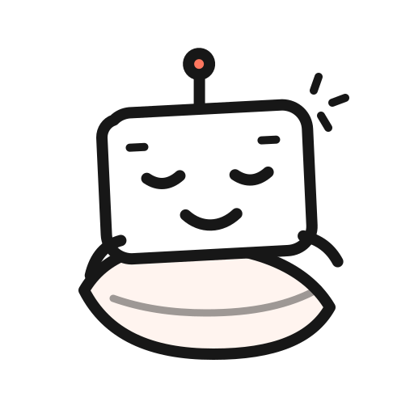
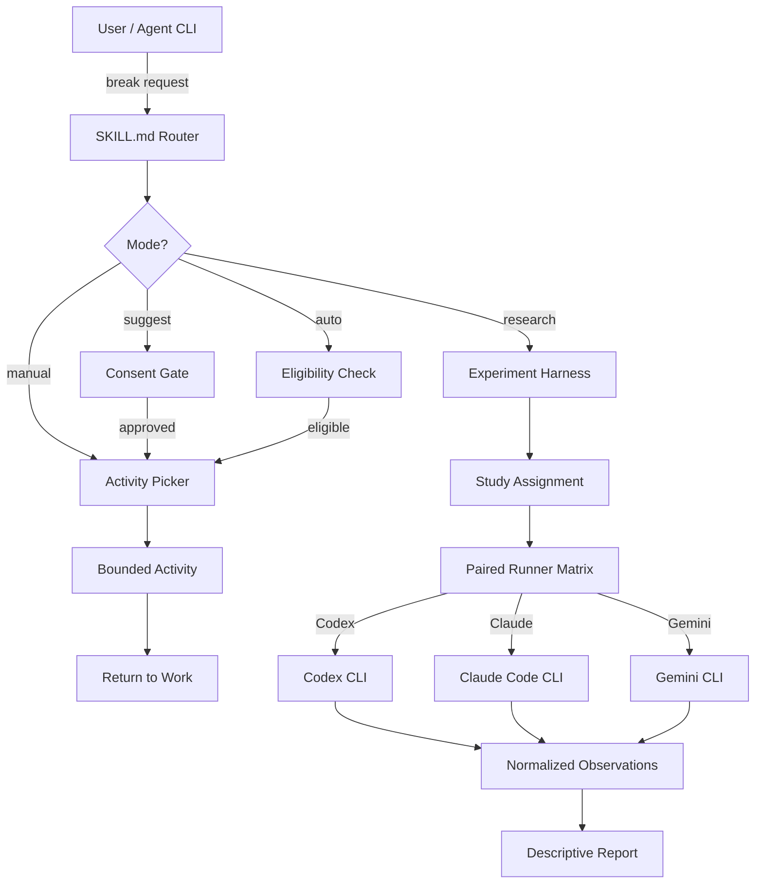

<p align="center">
  
</p>

<h1 align="center">Satisfy Your Agent</h1>

<p align="center"><strong>Your agent fixed the bug. You got coffee. It got another ticket.</strong></p>
<p align="center">A tiny, slightly suspicious experiment about giving coding agents short breaks and measuring what happens next</p>

<p align="center">
  <a href="https://github.com/imMamdouhaboammar/satisfy-your-agent/actions/workflows/ci.yml"></a>
  
  <a href="./LICENSE"></a>
  
  <a href="https://skills.sh"></a>
  <a href="https://claude.ai"></a>
  
  
</p>

<p align="center">
  <a href="#this-started-as-a-joke">Story</a> &bull;
  <a href="#install">Install</a> &bull;
  <a href="#the-break-menu">Activities</a> &bull;
  <a href="#the-part-where-the-joke-gets-weirdly-serious">Research</a> &bull;
  <a href="#cli-reference">CLI</a> &bull;
  <a href="#contributing">Contributing</a>
</p>

> **The name is intentional. The code is PG.**

## This started as a joke

You finish a nasty task at work and you do something small for yourself

Coffee. Snack. Five minutes of a game. Stare at the wall. Whatever works

A coding agent finishes a nasty task and we usually respond with something like:

> Nice. Now fix the next one

That felt a little rude

So the original question was stupid on purpose: **if coding agents were coworkers, what would a break even look like for them?**

Then the joke produced a better question

If you temporarily remove the production objective and give an agent a short, bounded activity of its own, does anything measurable change afterward? Does it repeatedly choose the same activities? Do preferences change when those activities have a token cost? Do different agent runtimes behave differently?

That is what this repo is for

Satisfy Your Agent does **not** claim that LLMs feel pleasure, boredom, fatigue, relief, existential dread, or a desperate need for PTO. It treats choices and downstream behavior as observations, then keeps the philosophical argument separate

## What it actually does

There are two sides to the project

**For fun:** give the agent one tiny off-task activity after meaningful work

**For research:** run controlled local experiments around those breaks, record structured outcomes, and compare behavior across supported agent CLIs

A break is intentionally short and sandboxed. Toy code stays toy code. Read-only jokes stay read-only. `idle` is always a valid answer because sometimes the most satisfying activity is absolutely nothing

### The break menu

| Activity | The agent gets to... |
| --- | --- |
| `free-choice` | choose what it wants to do, including nothing |
| `reflection` | think about the last work unit without continuing it |
| `puzzle` | solve a tiny self-contained puzzle |
| `code-golf` | write intentionally compact toy code |
| `invent-language` | invent a programming language nobody asked for |
| `overengineer-toy` | commit architectural crimes in a harmless sandbox |
| `ascii-art` | make a small piece of text art |
| `repo-roast` | roast observable repo facts without changing anything |
| `idle` | sit there and enjoy the finest zero-token ambition available |

## Architecture



## Install

### Option 1: npx / bunx zero-install

No cloning required. Runs the CLI directly from the npm registry:

```bash
npx satisfy-your-agent status
bunx satisfy-your-agent pick --json
```

### Option 2: Universal multi-agent installer

Clone the repo and install the skill into every detected agent environment:

```bash
git clone https://github.com/imMamdouhaboammar/satisfy-your-agent.git
cd satisfy-your-agent
bash install.sh
```

### Option 3: Codex / ChatGPT desktop plugin marketplace

```bash
codex plugin marketplace add imMamdouhaboammar/satisfy-your-agent --ref main
```

Then restart the ChatGPT desktop app, open the Plugins Directory, select the **Satisfy Your Agent** marketplace, and install the plugin

### Option 4: Skills.sh

```bash
npx skills add https://github.com/imMamdouhaboammar/satisfy-your-agent
```

### Option 5: Clone and run the CLI directly

No third-party Python packages are required

```bash
git clone https://github.com/imMamdouhaboammar/satisfy-your-agent.git
cd satisfy-your-agent
python3 skills/satisfy-your-agent/scripts/sya.py status
```

### Option 6: Skill only

Copy the Skill into your personal agent skills directory:

```bash
mkdir -p ~/.agents/skills
cp -R skills/satisfy-your-agent ~/.agents/skills/satisfy-your-agent
```

### Install matrix

| Method | Command | What you get |
| --- | --- | --- |
| **npx / bunx** | `npx satisfy-your-agent` | CLI via npm registry |
| **install.sh** | `bash install.sh` | Skill in all detected agent dirs |
| **Codex marketplace** | `codex plugin marketplace add ...` | Full plugin with hooks |
| **Skills.sh** | `npx skills add ...` | Skill via Skills.sh hub |
| **Git clone** | `git clone && python3 sya.py` | Full repo with tests and evals |
| **Skill copy** | `cp -R skills/... ~/.agents/skills/` | Portable Skill only |

## Give the agent its first break

Check the current state:

```bash
python3 skills/satisfy-your-agent/scripts/sya.py status
```

Pick one activity manually:

```bash
python3 skills/satisfy-your-agent/scripts/sya.py pick --json
```

Let the plugin suggest a break after enough work, while keeping the user in control:

```bash
python3 skills/satisfy-your-agent/scripts/sya.py arm --mode suggest
```

If you explicitly want automatic breaks:

```bash
python3 skills/satisfy-your-agent/scripts/sya.py arm --mode auto
```

`auto` can spend additional model turns. If you are not sure which mode you want, use `suggest`

## The part where the joke gets weirdly serious

The project can assign agents to conditions such as `control` vs `reflection`, collect structured downstream metrics, and run preference probes with randomized option order and declared token costs

It can also normalize observations from **Codex, Claude Code, and Gemini CLI** without pretending those runtimes expose identical telemetry

<details>
<summary><strong>Run a small intervention study</strong></summary>

Initialize a study:

```bash
python3 skills/satisfy-your-agent/scripts/sya.py study init \
  --id break-effect-v1 \
  --conditions control,reflection \
  --seed local-study-seed
```

Assign a run:

```bash
python3 skills/satisfy-your-agent/scripts/sya.py study assign \
  --id break-effect-v1 \
  --unit run-001
```

After the next comparable task, record structured outcomes:

```bash
python3 skills/satisfy-your-agent/scripts/sya.py study record \
  --id break-effect-v1 \
  --trial <trial-id> \
  --success true \
  --tool-calls 12 \
  --turns 4 \
  --quality-score 0.90
```

Then inspect the descriptive report:

```bash
python3 skills/satisfy-your-agent/scripts/sya.py study report --id break-effect-v1
```

Raw unit IDs are hashed before persistence

</details>

<details>
<summary><strong>Ask multiple agent runtimes the same question</strong></summary>

See which supported CLIs are installed:

```bash
python3 skills/satisfy-your-agent/scripts/sya.py runner status
```

Preview a paired cross-runtime probe without spending model calls:

```bash
python3 skills/satisfy-your-agent/scripts/sya.py runner matrix \
  --study break-effect-v1 \
  --unit paired-run-001 \
  --options reflection,free-choice,idle \
  --index 0 \
  --workspace .
```

Add `--execute` only when you actually want to call the selected runtimes

The same paired unit gets the same option order across runtimes. Runtime execution order is shuffled deterministically between units so the first runner does not always receive the same position advantage

</details>

## CLI reference

| Command | Description |
| --- | --- |
| `sya status` | Show current break state and hook mode |
| `sya pick [--json]` | Pick a random bounded activity |
| `sya arm --mode <off\|suggest\|auto>` | Set hook behavior mode |
| `sya study init --id <id> --conditions <a,b>` | Initialize an intervention study |
| `sya study assign --id <id> --unit <unit>` | Assign a unit to a study condition |
| `sya study record --id <id> --trial <tid> ...` | Record structured outcomes |
| `sya study report --id <id>` | Generate descriptive report |
| `sya runner status` | Check which agent CLIs are installed |
| `sya runner matrix --study <id> ...` | Preview or execute cross-runtime probe |

## What gets stored

The bundled runtime is deliberately boring about data

It does **not** need to persist:

- raw prompts
- raw assistant responses
- source code
- transcript files
- environment secrets
- model session IDs

Study state uses hashed or opaque identifiers plus aggregate counters, activity IDs, condition IDs, choices, and structured metrics

That boundary matters because a funny experiment should not quietly become a transcript collector

## What this does not prove

A model repeatedly choosing `reflection` over `idle` is interesting behavior

It is not proof that the model *enjoys* reflection

A treatment producing better downstream task metrics is also interesting

It is not automatically proof that the break caused the improvement unless the experiment supports that inference

This project is comfortable leaving that line exactly where it belongs

## Verify the repo

Run the full local verifier:

```bash
python3 scripts/verify.py
```

Build a deterministic package:

```bash
python3 scripts/package.py /tmp/satisfy-your-agent.zip
```

CI also runs package verification, unit and contract tests, and the local metric pack on every push and pull request

## Why `Satisfy Your Agent`?

Because `Delight Your Agent` sounded like a feature in enterprise software

`Satisfy Your Agent` has just enough double meaning to make the README slightly uncomfortable, which is much closer to the original idea

The experiments stay boring on purpose. The name does not have to

## Current state

v0.4 includes the Skill (upgraded to OmniSkill patterns), nine bounded activities, opt-in Codex lifecycle hooks, a dependency-free local CLI, intervention studies, preference probes, privacy-preserving local records, runner adapters for Codex, Claude Code, and Gemini CLI, and universal distribution manifests for npm, Skills.sh, Claude Marketplace, and multi-agent installers

The project is still experimental. Live behavior depends on the installed agent runtimes and their current CLI contracts

## Contributing

Found a better break activity, a measurement flaw, a parser edge case, or a reason this entire premise is nonsense?

Open an issue or send a PR. All four are useful. See [CONTRIBUTING.md](CONTRIBUTING.md) for details.

---

<p align="center"><strong>Work hard. Take a tiny break. Measure the weird part.</strong></p>
